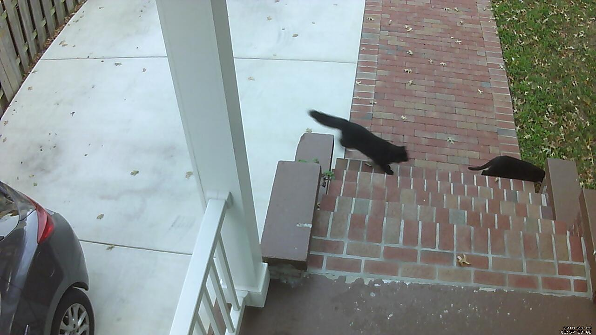

# Human Not Human

One of the tricks I keep coming back to as I attempt to grow my skillset within machine learning is determining the right kind of problem to solve.  The amount of information on building models, and learning linear algebra is vast and thorough.  However like many things in tech, it's easy to find a hello world.  It's also easy to find the code example with some subtle nuance explained for the experts.  I needed a middle path.  So as I'm getting my feet on the ground, I thought I'd write a binary classification post for mortals.  My focus is on the minutia of working with the data, and how to pick a problem that's simple enough to solve from the ground floor.


[Rubin Vase](https://en.wikipedia.org/wiki/Rubin_vase)

# Binary Classification for Mortals

As it happens, I recently installed a fixed position camera to a Raspberry Pi over my porch.  I wrote some code to text me when a motion event triggers.  And then came a text every 20 minutes with a picture of a cat on it.  Seriously, my neighborhood is overrun with cats!  Understanding the data usage and structure is critical to understanding how to answer problems with ML.  The information available on machine learning often doesn't answer the question of the effort that must go into processing the input data to get to solving a problem.  In my own learning path, I have constantly felt I am starting from less than zero because getting to the point of writing the model is so time intensive.  The global solution to the complexities of data curation within Data Science at large is to be very prescriptive in model input structures.  This is an appropriate solution, however, it hides the unfortunate fact about data science. The majority of data science is being a digital librarian and plumber.

**Note -- I have not included the dataset I used in the repo since it contains pictures of my family.  I would be willing to share it with others, but choose to do so by request only.

### Processing the data -- The hard work
The bulk of this exercise was me doing data entry.  There are cooler ways to pre-train or to do unsupervised learning, but the existing datasets tend to hide how much work went into curating them.  The convenience of `mnist.load_data()` is amazing!  However to solve problems customized to a specific dataset requires usage of that specific dataset.  This was exactly as boring as you think it was.  Additionally, I counted people, and counted cars so I can try a few other models on this dataset in the future.  I started counting cats as well, but there were too many so I stopped (not a joke).

### Building training validation and test datasets
The critical takeaway I keep coming back to is that the data for any neural network is a matrix or array of tensors.  Or any way you want to describe a structured collection of numeric values we are going to backpropagate against.  It's easy to get tied into the examples demanding a specific directory structure or a specific input encoding, but as long as you end up with matrices, then you'll be ok.  There are good reasons to follow standards, and using baked systems for training like Sagemaker will demand a specific input structure, but I would actually recommend doing an exercise of conversion from a starting point that isn't:
```
| data
    | train
    | test
```

In my case, the raw data is just a csv with an image path and a few columns of classified data.  In order to input model for training validation and test, I first created the input matrix and the output vector list.

```python
dataset = np.ndarray(shape=(len(data), target_height, target_width, channels), dtype=np.float32)
y_dataset = []
i=0

# Set of markers so I can create an lst
for index, row in data.iterrows():
    y_dataset.append(row.human)
    img = load_img(basePath + '/' + row.filename, target_size=(target_height, target_width))
    x = img_to_array(img)
    x = x / 255.0
    dataset[i] = x
    i += 1
```

Then I used the sklearn train_test_split to randomly generate cohorts for train and validation data.  Lastly I split the validation in half for validation and test.

```python
x_train, x_val_test, y_train, y_val_test = train_test_split(dataset, y_dataset, test_size=0.4)

validation_length = int(len(x_val))
# Separate validation from test
x_val = x_val_test[:validation_length]
y_val = y_val_test[:validation_length]

x_test = x_val_test[validation_length:]
y_test = y_val_test[validation_length:]

x_train.shape
```

## The model
The model is the `hello world` binary classification model with a few added tweaks that seemed like a good idea at the time.  I can follow the model structure and understand the underpinning math behind it, but there's a world of difference between following along vs playing jazz.I highly recommend the [Cholet's book](https://www.manning.com/books/deep-learning-with-python) for a primer on gradient descent and the chain rule that underpins what's happening in the model.  I also resized the images so the memory footprint is lowered.  This dropped training time by an order of magnitude.

```python
model = Sequential()

model.add(Conv2D(32, (3, 3), activation='relu', input_shape=x_train[1,:].shape))
model.add(MaxPooling2D((2, 2)))

model.add(Conv2D(64, (3, 3), activation='relu'))
model.add(MaxPooling2D((2, 2)))

model.add(Conv2D(128, (3, 3), activation='relu'))
model.add(MaxPooling2D((2, 2)))

model.add(Conv2D(128, (3, 3), activation='relu'))
model.add(MaxPooling2D((2, 2)))

model.add(Flatten())
model.add(Dense(512, activation='relu'))
model.add(Dropout(0.5))
model.add(Dense(1, activation='sigmoid'))

model.compile(loss='binary_crossentropy',
              optimizer='rmsprop',
              metrics=['accuracy'])
```


### Why this model works relatively well
Data science purists will likely notice this is not generalized as a classifier for humans.  My colleague suggested we try his front door cam, and I suspect it will perform poorly.  But the important takeaway is that it solves an actual problem for this specific use case, and it really didn't take me that long, or that much data to get here.  Purists will chide me related to overfitting or other data integrity / bias mistakes, but now that I can successfully remove the cat text messages, I remain enthused.

## Training
The first time I ran this, I trained on my laptop.  This took about 4 hours for 4 epochs.  So I started looking into Sagemaker and Kaggle. Both offer an amazing service, and both have drawbacks.  Kaggle is somewhat limited in how you can load your own data.  And Sagemaker gives notebooks that are powerful yet expensive, and getting your data to these mediums is where the complexity lies.  I have the local notebook along with the version I used in Sagemaker.  My advice remains consistent with what I have found related to AWS... If you're going to that party, you had better drink all the koolaide.  If you are trying to take a half step into the world of AWS, you will encounter every edge case that they lock down.  I didn't take my own advice in this case and ended up uploading my data to S3 and pulling it into a Jupyter notebook on Sagemaker.  The training speed was pretty tolerable, and the network didn't seem to hurt too much in terms of time spent.  There are more prescribed ways to create training jobs in Sagemaker, but that's for another day.  Kaggle would have worked if I had been smarter in my data construction and not required to load the whole dataset into ram as a list.  But things to know for the future.  There's always something new to learn.

```python
batch_size=16
epochs=10

model.fit(x_train, y_train, batch_size=batch_size, epochs=epochs, verbose=1, validation_data=(x_val,y_val))
model.save('current_full.h5')
```

I trained on 797 images for the second passes.  171 validation images, and 171 test images.  These cohorts were chosen randomly.

## Model evaluation
I used the test data that I set aside to do evaluation.  Here are the top level results.
- loss: 0.5187677096205148
- acc: 0.877192983850401
I'm honestly still getting a feel for how to interpret results, but I got to the point of being anecdotally satisfied with the results by writing a bulk process script.  This script copies the files in a directory into a path classified set of images according to a set threshold (80% probability of human).  This was a good way to gut check how the problem could be used in the future.

```Python
#!/usr/bin/env python
# coding: utf-8

from keras.models import load_model
from keras.preprocessing.image import img_to_array, load_img

import os
from shutil import copyfile, rmtree
import sys

import numpy as np


def isHuman(filepath):
    img = load_img(filepath, target_size=(target_height, target_width))
    x = img_to_array(img)
    x = x / 255.0

    size = img.size

    dataset = np.ndarray(shape=(1, size[1], size[0], channels),dtype=np.float32)
    dataset[0] = x
    result = model.predict(dataset)
    return result[0][0]

# load the model
model = load_model('../models/human_not_human.h5')

# Base values
target_height = 180
target_width = 320
channels = 3

accept_threshold = 0.8

path = sys.argv[1]
print(path)

if not os.path.exists(path):
    raise Exception('`{}` does not exist or is not a directory'.format(path))


# Initialize the directory and ensure it's only our current version
dstPath = './data/tested/'
if os.path.exists(dstPath):
    rmtree(dstPath)
os.makedirs(dstPath)
os.makedirs(os.path.join(dstPath, '0'))
os.makedirs(os.path.join(dstPath, '1'))
for f in os.listdir(path):
    if f.endswith('.jpg'):
        filepath = os.path.join(path, f)
        human = '1' if isHuman(filepath) > accept_threshold else '0'
        copyfile(filepath, os.path.join(dstPath, human, f))
```

## Going to production
Once I had the model trained.  It is pretty trivial to save and load using Keras.  I created two `production` scripts.  One that I can pass a url and get a prediction.  The second iterates a directory and copies them into a sorted directory structure.  Here is the full operational classifier script.

```python
#!/usr/bin/env python
# coding: utf-8
from keras.models import load_model
from keras.preprocessing.image import img_to_array, load_img

import sys
from urllib.request import urlopen

import numpy as np

model = load_model('full.h5')

url = sys.argv[1]
print(url)

img = load_img(urlopen(url))
x = img_to_array(img)
x = x / 255.0

size = img.size
channels=3

dataset = np.ndarray(shape=(1, size[1], size[0], channels),dtype=np.float32)
dataset[0] = x
result = model.predict(dataset)

print(result[0][0])
```

I still have to attach this to the camera so for now I'm still getting cat notifications on my phone.  But I constantly am running `python guess.py http://...` with enthusiasm for the ground up solution.



## Links
- [Deep Learning with Python](https://www.manning.com/books/deep-learning-with-python)
    - I cannot recommend this book enough.
- [Image Kernel Visualization](http://setosa.io/ev/image-kernels/)
- [Everything you should know about data management](https://towardsdatascience.com/everything-a-data-scientist-should-know-about-data-management-6877788c6a42)
